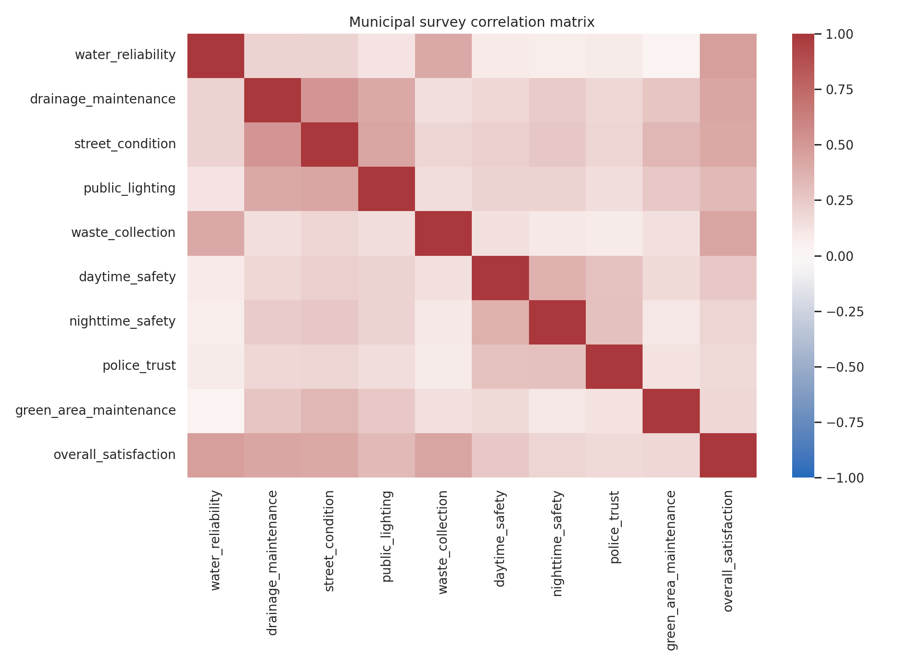
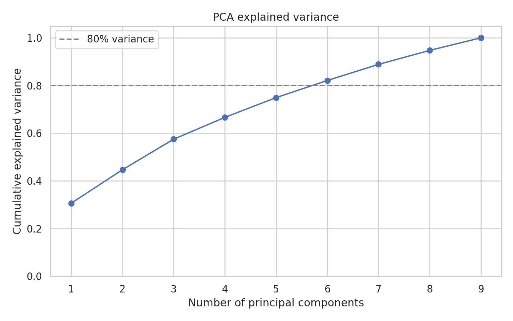
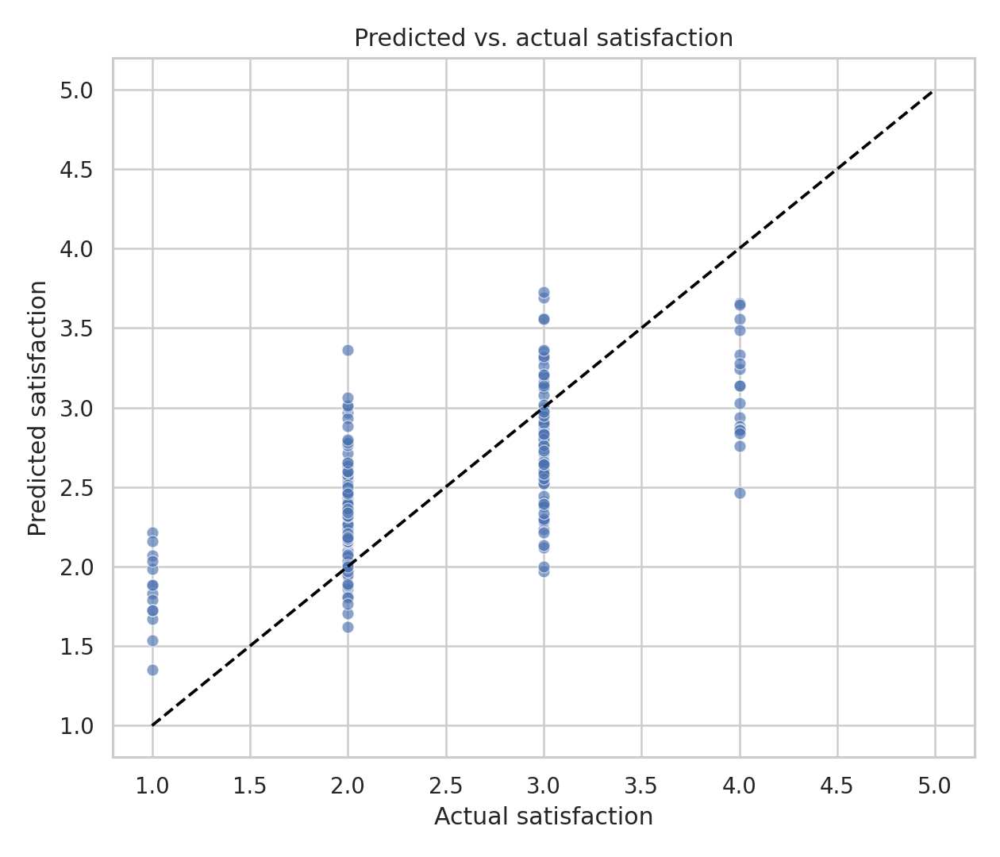

# Municipal Survey Analytics

End-to-end analysis of a synthetic municipal-services survey using Python. The project demonstrates data cleaning, exploratory analysis, dimensionality reduction, regression, and reproducible reporting while protecting respondent privacy.

## Why this project exists

This portfolio project is based on a personal collaboration in which survey responses were explored and visualized. The original survey included potentially identifying fields such as street, postal code, IP address, and derived coordinates. None of those records are included here.

The repository uses a deterministic synthetic dataset that preserves the analytical shape of the problem without representing real respondents.

## Questions explored

- Which municipal services are most strongly associated with overall satisfaction?
- How are water reliability, street maintenance, lighting, and perceived safety related?
- Can a smaller set of latent dimensions summarize the survey?
- How accurately can satisfaction be estimated from service ratings?

## Project structure

```text
municipal-survey-analytics/
├── analysis.py
├── generate_synthetic_data.py
├── municipal_survey_synthetic.csv
├── correlation_heatmap.png
├── pca_explained_variance.png
├── predicted_vs_actual.png
├── metrics.json
├── .gitignore
├── LICENSE
├── README.md
└── requirements.txt
```

## Methods

- Reproducible synthetic-data generation
- Missing-value handling and validation
- Exploratory data analysis and correlation matrix
- Principal Component Analysis (PCA)
- Train/test evaluation of a linear regression model
- Feature-importance reporting from standardized coefficients
- Export of charts and summary metrics

## Results

The model was evaluated on 188 held-out synthetic responses (25% of the dataset).

| Metric | Result | Interpretation |
| --- | ---: | --- |
| Mean absolute error (MAE) | 0.4489 | Predictions differ from the 1–5 satisfaction score by about 0.45 points on average. |
| R-squared | 0.4607 | The service ratings explain about 46% of the variation in overall satisfaction in the synthetic test data. |
| First PCA component | 30.6% | The strongest latent dimension captures a broad municipal infrastructure and service-quality pattern. |
| First three components | 57.5% | Three components summarize over half of the standardized survey variation. |

The largest standardized regression coefficients were:

1. **Water reliability (0.2810)** — the strongest predictor of overall satisfaction.
2. **Waste collection (0.1935)** — the second-largest association.
3. **Drainage maintenance (0.1819)** and **street condition (0.1817)** — nearly equal contributions.
4. **Daytime safety (0.1061)** — a smaller but positive association after controlling for other ratings.

These results illustrate the complete analytical workflow. Because the data are synthetic, they should not be interpreted as findings about a real municipality.

### Correlation structure



### Dimensionality reduction



### Predictive performance



## Quick start

```bash
python -m venv .venv
source .venv/bin/activate  # Windows: .venv\\Scripts\\activate
pip install -r requirements.txt
python generate_synthetic_data.py
python analysis.py
```

The generated dataset, charts, and metrics are written to the repository root.

## Privacy and limitations

- No original survey responses are included.
- The generated records are fictional and must not be interpreted as evidence about a real municipality.
- Correlations in observational survey data do not establish causality.
- Results are intended to demonstrate an analytical workflow, not to evaluate a public administration.

## Skills demonstrated

Python, pandas, NumPy, seaborn, matplotlib, scikit-learn, statistical interpretation, data privacy, and reproducible analysis.

## Author

Emmanuel Gallegos Montiel — Actuary and Applied Artificial Intelligence graduate student.
